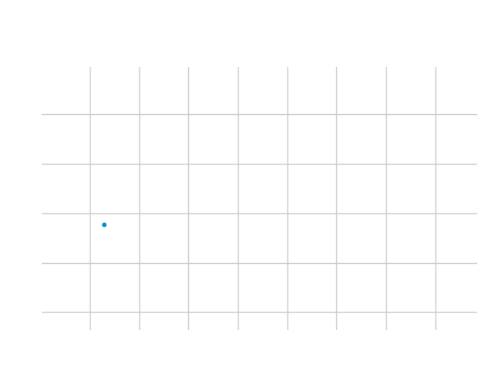
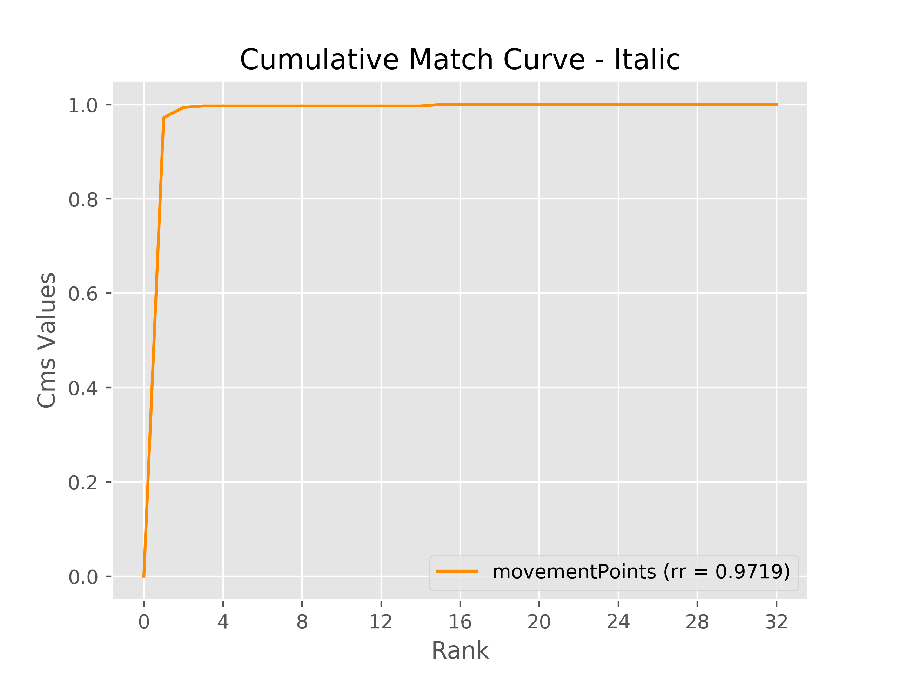
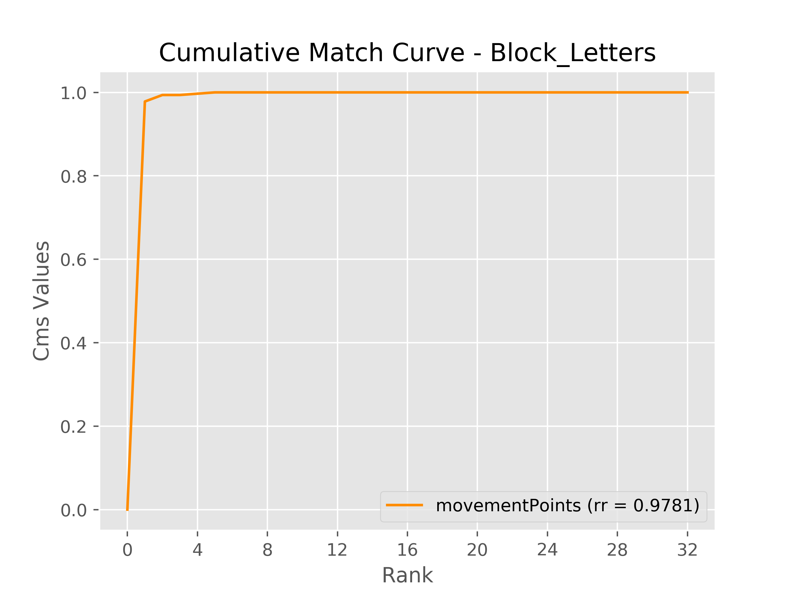
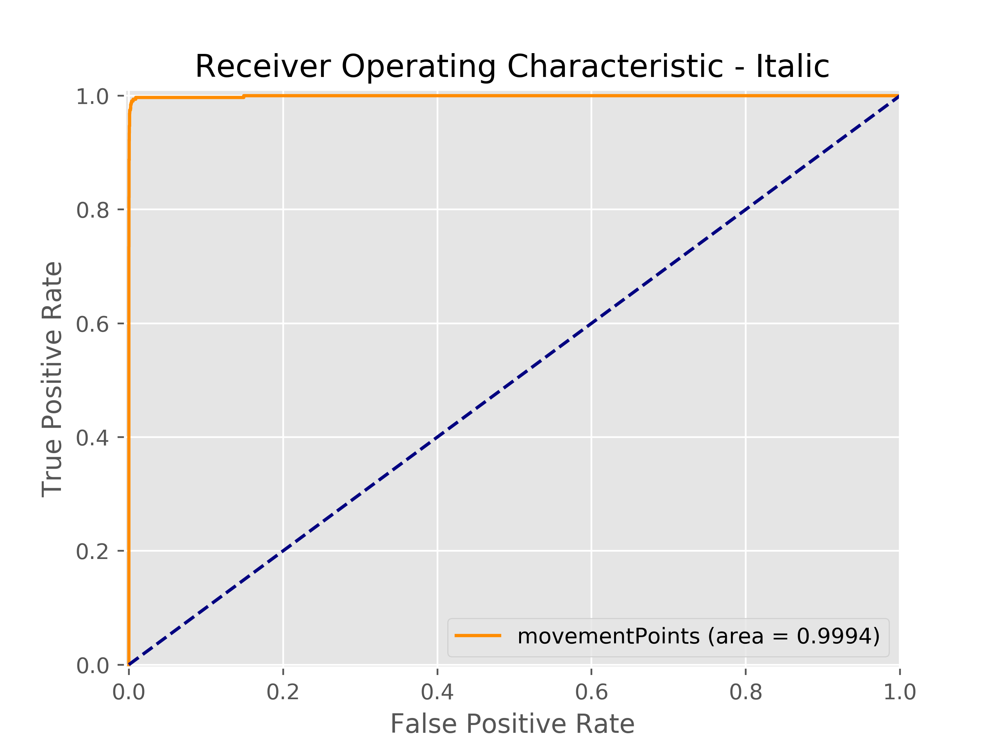
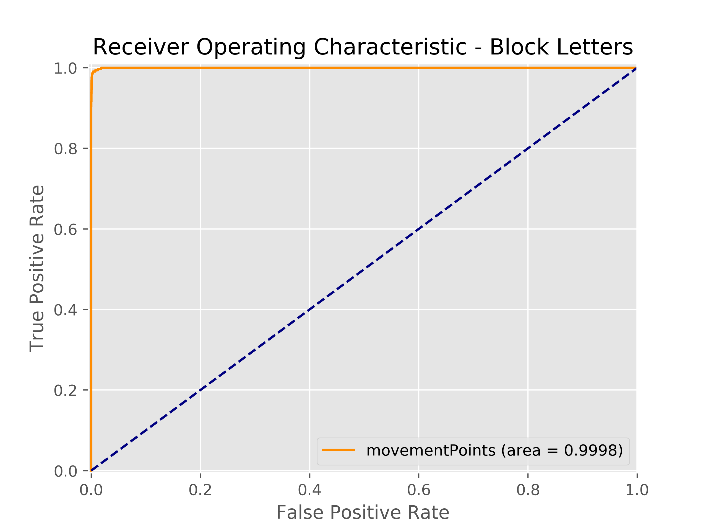
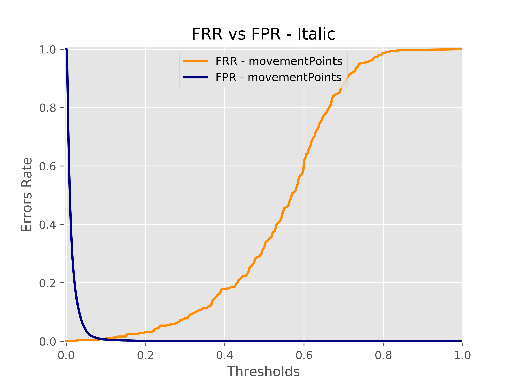
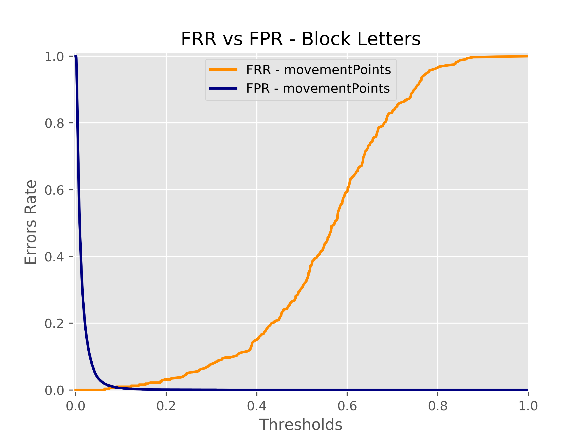

# Biotouch
This system is able to recognize users from their writing style on a touchscreen.

The dataset has been gathered through the use of the Biotouch [android application](https://github.com/LucaMoschella/Biotouch)

 

The performance of the system are very encouraging both in identification and verification:

| Italic             |  Block letters |
:-------------------------:|:-------------------------:
  |  
  |  
  |  

Read more in the [docs](https://github.com/LucaMoschella/BiotouchLearner/tree/master/docs)
